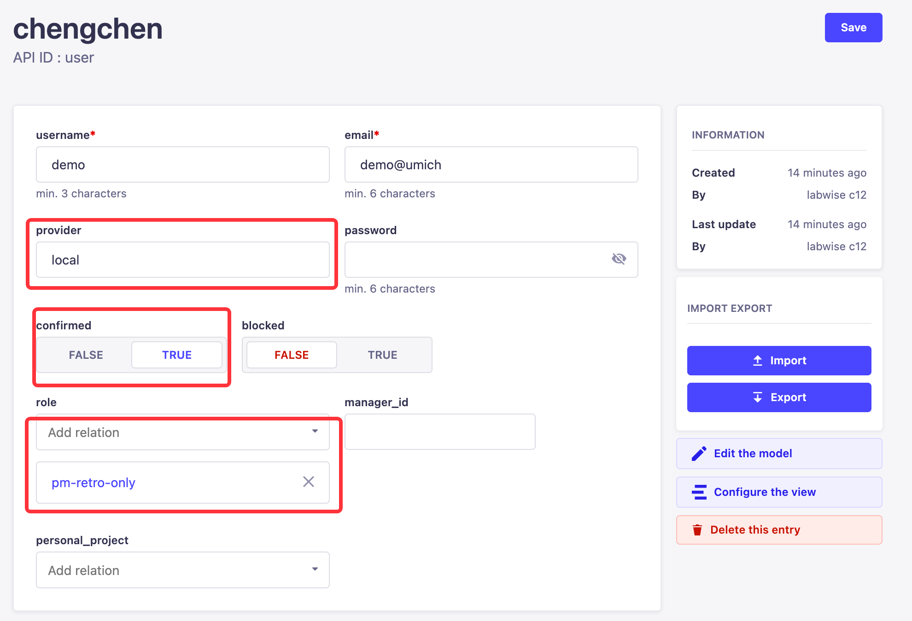

# Admin Operations Guide

Welcome to the "Admin Operations Guide". This document serves as a comprehensive manual designed to provide System
Administrators with essential information and step-by-step procedures for managing product accounts and conducting
installations.

## Account management

1. Type the domain.com:1337/admin and log-in with the admin account (will be provided to the system admin). In the
   Content Manager tab find the content “User”

   
2. Click the button “Create new entry”

   
3. Input:
    * The user name
    * The email
    * The provider **must** be local
    * Select TRUE for confirmed
    * Select False for blocked
    * The role **must** be pm-retro-only
    * You can leave the manager_id and personal project blank
   
      
    * Finally, click “Save”, then the account with the password can be used to the log-in Labwise.

4. Once an account is created, you can click the corresponding row to edit it

   

## Installation Guide

System requirement:
* Ram: ‎DDR4 64G with memory speed 3200MHz, or better
* CPU: ‎12th Generation Intel® Core™ i5 Processors, or better
* GPU: NVIDIA GeForce RTX 4060, or better
* Hard Drive: 512G or above
* Power supply: Output Wattage of 500, the other hardware mentioned above is upgraded, corresponding upgrades should also be made
* System: ubuntu 22.04(jammy)


### Install dependencies
Before installing Labwise, you need to install the dependencies for AI inference in the system: GPU driver, CUDA, and Docker.
#### Install GPU driver
Execute commands sequentially in the terminal

```
sudo apt update
```
```
sudo apt install ubuntu-drivers-common
```
```
sudo apt install nvidia-driver-530
```
```
sudo ubuntu-drivers autoinstall
```
```
reboot
```

#### Install nvidia-cuda
Execute commands sequentially in the terminal
```
export UBUNTU_VERSION=ubuntu2204/x86_64
```
```
wget https://developer.download.nvidia.com/compute/cuda/repos/$UBUNTU_VERSION/cuda-keyring_1.0-1_all.deb
```
```
sudo dpkg -i cuda-keyring_1.0-1_all.deb
```
```
sudo add-apt-repository "deb https://developer.download.nvidia.com/compute/cuda/repos/$UBUNTU_VERSION/ /"
```
```
export NVIDIA_DRIVER_VERSION=535
```
```
export CUDA_DRIVER_VERSION=535.154.05-1
```
```
sudo apt install cuda-drivers-${NVIDIA_DRIVER_VERSION}=${CUDA_DRIVER_VERSION} cuda-drivers=${CUDA_DRIVER_VERSION}
```
```
sudo apt-get remove dkms && sudo apt-mark hold dkms
```

#### Install docker 
Execute commands sequentially in the terminal
```
sudo apt install apt-transport-https ca-certificates curl software-properties-common
```
```
curl -fsSL https://download.docker.com/linux/ubuntu/gpg | sudo gpg --dearmor -o /usr/share/keyrings/docker-archive-keyring.gpg
```
```
echo "deb [arch=$(dpkg --print-architecture) signed-by=/usr/share/keyrings/docker-archive-keyring.gpg] https://download.docker.com/linux/ubuntu $(lsb_release -cs) stable" | sudo tee /etc/apt/sources.list.d/docker.list > /dev/null
```
```
sudo apt update
```
```
apt-cache policy docker-ce
```
```
sudo apt install docker-ce
```
```
sudo systemctl status docker
```
```
sudo usermod -aG docker ${USER}
```
```
sudo systemctl restart docker
```

#### Install nvidia-docker
```
curl -fsSL https://nvidia.github.io/libnvidia-container/gpgkey | sudo gpg --dearmor -o /usr/share/keyrings/nvidia-container-toolkit-keyring.gpg \
&& curl -s -L https://nvidia.github.io/libnvidia-container/stable/deb/nvidia-container-toolkit.list | \
sed 's#deb https://#deb [signed-by=/usr/share/keyrings/nvidia-container-toolkit-keyring.gpg] https://#g' | \
sudo tee /etc/apt/sources.list.d/nvidia-container-toolkit.list
```
```
sudo sed -i -e '/experimental/ s/^#//g' /etc/apt/sources.list.d/nvidia-container-toolkit.list
```
```
sudo apt-get update
```
```
sudo apt-get install -y nvidia-container-toolkit
```
```
sudo nvidia-ctk runtime configure --runtime=docker
```
```
sudo systemctl restart docker
```

### Install and update Labwise
You have now completed the installation of the Labwise dependencies, please install Labwise in the following way.

#### Fresh installation of Labwise
Execute the following command in the terminal:

```
wget -qO - https://www.c12.ai/static/installer-1.0.1.sh |bash -s "laurencecao" "dckr_pat_B73Lxpujiq4VcUWv_I5yMOS6TuE"
```


#### Update Labwise
We have deployed an updater in Labwise, which regularly checks for new updates from docker hub. When it discovers new updates, users can choose to start the update at an appropriate time.


If you choose to turn off the updater, Labwise will only visit time.cloudflare.com(NTS) to check whether the licence is expired.


##### Start and stop the updater

You can start the updater by executing the following command in the terminal:
```
sudo systemctl start c12updater
```
To stop the updater:
```
sudo systemctl stop c12updater
```
To check if the updater is turned on:

```
sudo systemctl status c12updater
```

##### Update Labwise
When there's an update, we will let you know via email.

Type the domain.com:1337/admin to the browser and log-in with the admin account (will be provided to the system admin).

Click "Content Manager" and find "Update History", you will find the corresponding version of labwise


Click the row and set "confirm_update" to *True*, the updater will update Labwise within 5 minutes.

