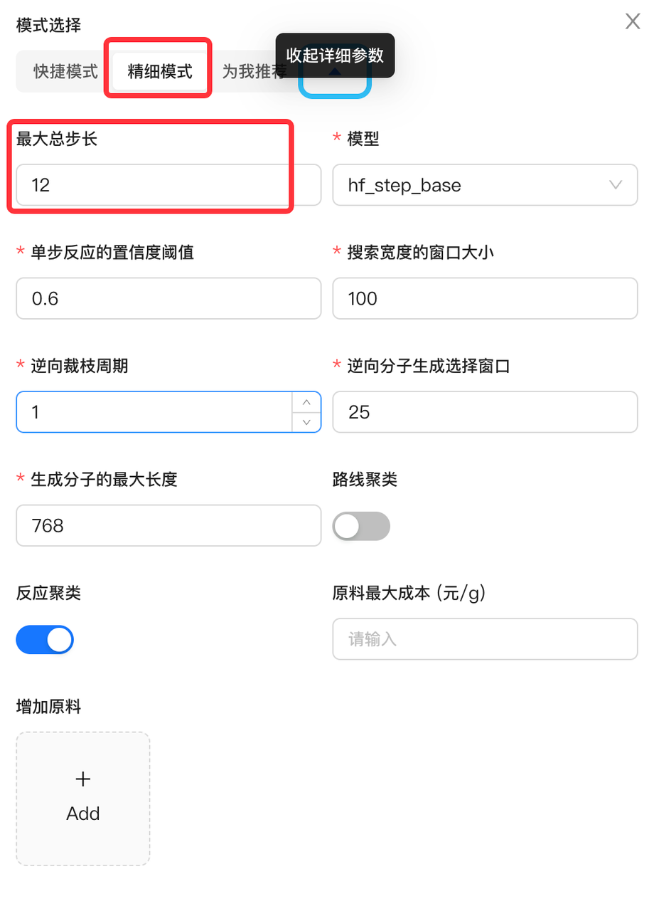
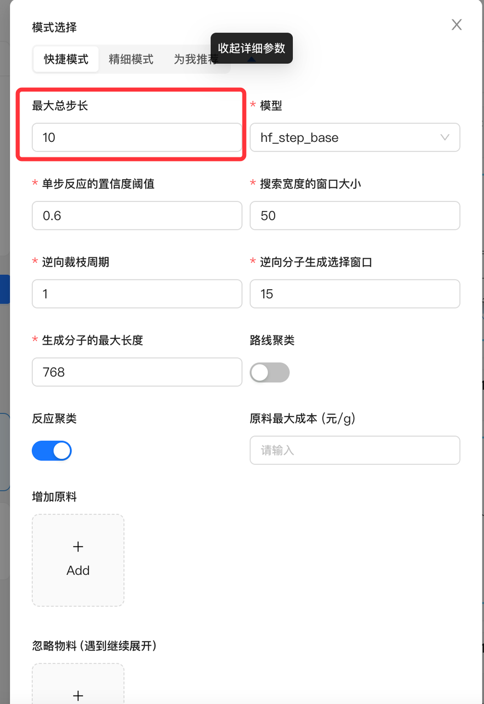
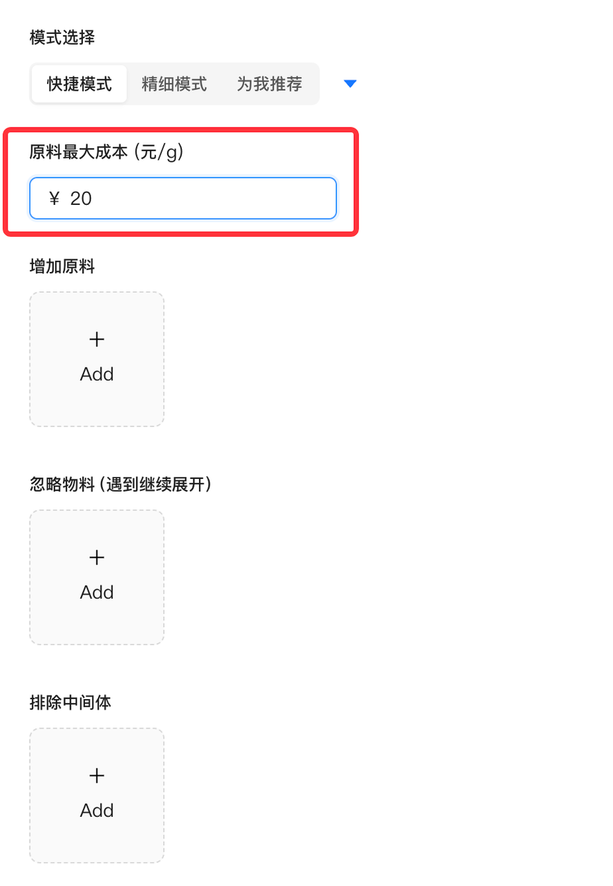
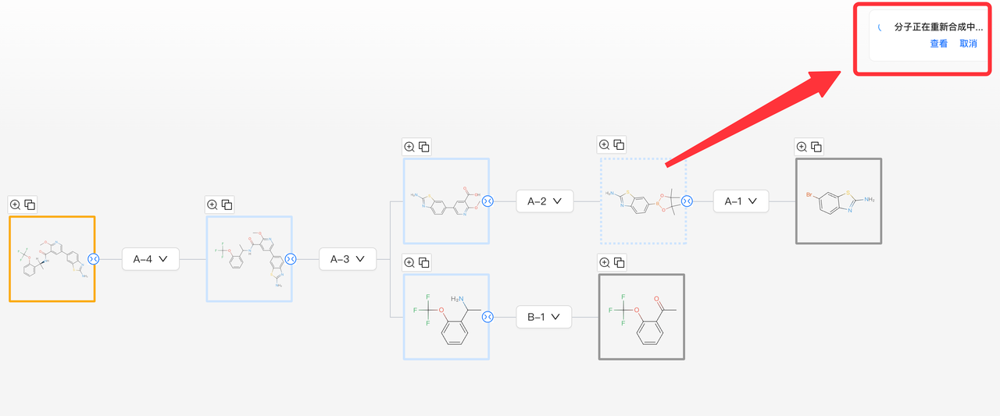

## 常见问题

### Q：一般要等多久能查看路线？
A：搜索的时间分子的情况而定，一般来说分子的路线越长，时间越久。以下仅供参考。样本：抽样5个专利分子，测试结果如下

### Q：如果搜不出来路线怎么办？
A: 可以重新搜索，使用“精细模式”，适当加大“最大总步长”。

### Q：搜索出来的路线都太长了怎么办？
A：可以在搜索参数中，调整最大总步长，如限制在10步以内，那么返回的路线均会小于等于10步

### Q：搜索出来的路线中的原料有些太贵了怎么办？
A：可以在搜索参数中，限制原料最大成本

### Q：在查看路线时，觉得某个中间体的合成步骤不够好，想再搜索下其他合成办法，如何操作？
A：可以点击编辑，进入路线的编辑模式，点击该中间体上的第三个按钮-以该分子为目标分子重新逆合成，即可跳转到一个新页面，进行搜索。若对搜索出的某条路线比较满意，点击选中，则可覆盖到原来的路线上。若对搜索的结果均不满意，则可以回到原来路线页面，取消本次的重新逆合成
