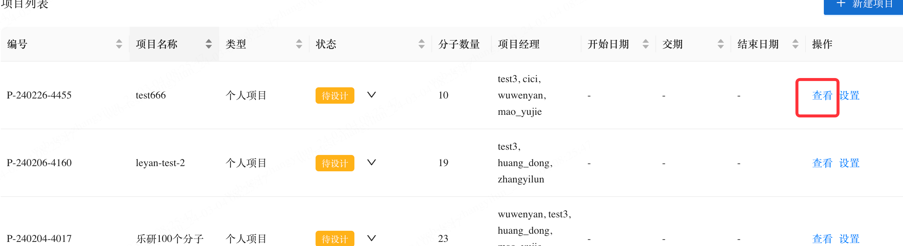

# 产品介绍

Labwise是一个由C12.ai开发的AI应用程序，旨在利用最新的生成式AI技术为科学家提供AI辅助的逆合成服务。用户可以利用Labwise，在AI的帮助下设计具有可靠的、新颖的、多样的路线。
本手册用于指导用户了解Labwise的主要功能。它包括使用生成式AI模型进行逆合成设计，查看合成路线中每个反应的参考反应等详细步骤

# 入门介绍

这部分介绍了发起逆合成设计的流程，旨在让您熟悉产品的功能和界面。这个概述提供了对基本功能的理解，有助于快速上手使用Labwise。后续的章节将探讨我们产品更复杂的功能，并提高您对系统的熟练程度。

## 1、登录和布局

1)打开您的Chrome浏览器，导航至labwise-d.beigenecorp.net。使用您的域账号登录。

2)左侧列是主要的导航栏。在“项目”模块内，您将能够添加项目、分子，并启动逆合成设计任务。另外，“实验区”模块允许直接输入分子结构，并立即开始设计过程。无论您是管理综合项目还是尝试单个分子的实验，这样设计都能简化您的工作流程，

3)点击折叠/展开按钮，可以折叠/展开左侧的导航面板

## 2、快速逆合成

快速逆合成专为首次使用者快速熟悉我们的系统而设计。

1）进入快速逆合成

2)发起逆合成任务

注意：初次访问此页面可能需要几秒钟来加载前端资源。随后的页面访问应该会更快。 

3)输入目标化合物

- 为分子命名一个ID

使用以下方法之一输入分子结构：

a) 从ChemDraw或其他来源复制SMILES
在ChemDraw中：

在Labwise中，点击文件夹图标，然后点击"从剪贴板粘贴"，将刚刚复制的SMILES粘贴进去。

现在，结构应该显示在画布上了。

b) 输入分子的名称或CAS号码

在输入分子的CAS号或名称后，点击“搜索分子”。
注意：此方法仅适用于常见分子。如果找不到相应的分子，请使用其他方法。

c) 使用分子图片
您可以点击“选择文件”以浏览您本地磁盘上保存的jpg/png文件。

Labwise需要几秒钟来识别结构。

现在，您应该在画布上看到分子的结构被显示出来了。

4）提交一个逆合成任务
点击“提交”开始一个逆合成任务。如果需要，您可以选择在屏幕右侧自定义以下参数以进行个别运行。

- 最长链长度：指定AI设计的所有路线中的最大反应步骤。如果分子较为复杂，请设置更高的值。
- 原料最大成本：指定AI设计路线中使用的起始物料的最大单价。 
- 原料库：仅使用这些供应商提供的起始物料。 
- 增加原料：除了指定供应商的材料库外，还指定更多的起始材料。 
- 忽略原料：指定AI不能使用的材料。 
- 高级设置：默认折叠，用于内部调试，您无需关注它。

5）查看正在进行的逆合成运行
• 在发起逆合成任务后，您应该会看到一个标记为“进行中”的新卡片，表示该任务正在被处理中。

• 如果提交了多个分子的逆合成任务，则后续的任务将以“排队中”的状态排队。

• 对于正在进行中的运行，如果AI找到了新的路线，卡片上会显示一个红色数字提示，显示新设计的路线数量，用户可以点击卡片来查看它们。

• 一旦发起了逆合成任务，您可以离开此页面并处理其他分子。您可以在左下角的操作表中查看所有您的逆合成任务 。

• 任务完成后，会弹出一个通知。点击“查看”按钮以查看AI设计的路线。在逆合成任务完成之前，您可以点击“取消”来取消任务，并且不会保存任何路线。

6）查看AI设计的路线
- AI生成的合成路线显示为主要路径，目标分子以黄色框标记，中间体以蓝色框标记，关键起始物料以黑色虚线框标记。您可以水平滑动以查看整个路线。每个分子和反应都是可点击的，允许您复制它们的SMILES以进行详细分析。 
- 路线长度：如果在相同的最长链下存在多个分支方案，则表示具有最短总步数的分支方案的总步数。 
- 总步数：路线中的总步数。 
- 最长链长度：如果合成路线没有分支，则此数字等同于上述的“总步数”。如果合成路线有多个分支，则此数字表示最长分支的长度。 
- 路线支链标志：指示“无支链”、“有支链”或“有多个支链”。 
- 智能评分：每条路线的算法计算的评分，范围在0到100之间。 
- 已知反应的比例：路线中报告的文献/专利中的反应占路线中总步数的比例。

点击“查看”以查看路线详细信息。

• 如果存在多个支链方案，用户可以切换查看多个支链方案。

• 点击"反应"以查看反应详情。

# 其他功能
## 项目管理

您可以创建一个项目，在项目中创建一系列分析，在项目中邀请您的合作者。只由这个项目的成员才有权限查看这个项目中的分子和路线。本节我们介绍了如果对项目进行管理。

### 创建项目
点击下图中的"新建项目"按钮来创建一个项目

默认的，创建项目的用户会成为项目经理，项目经理可以对项目中的成员进行管理.

### 修改项目

您可以点击下面的按钮修改项目的信息

### 取消项目
您可以点击项目的状态，将状态改为已取消来取消一个项目

被取消的项目默认不会显示，您可以通过选中"已取消"状态的项目来看到它

## 在项目中添加分子和发起逆合成

点击查看进入项目

点击右上角的"添加分子"，添加分子的方式和上一章中是一致的，在此不做郭队赘述。

在分子创建好以后，点击分子的卡片，进入这个分子的详情

点击"生成路线"进行逆合成，这个流程和上一章中介绍的是一致的，不做过多赘述。

## 取消分子

通过改变分子的状态取消分子

被取消的分子默认不显示，可通过勾选"已取消"状态查看被取消的分子

## 路线偏好

在AI路线页面，可点击下图中的图标来设置路线偏好，我们会根据您设置的偏好把合适的路线排列在列表的前面。

## 个人设置

您可以通过点击导航栏下侧的设置进入个人设置

您可以在这个页面配置个人的偏好，点击应用后，刷新已经打开的页面，或者进入新的页面时将会生效

