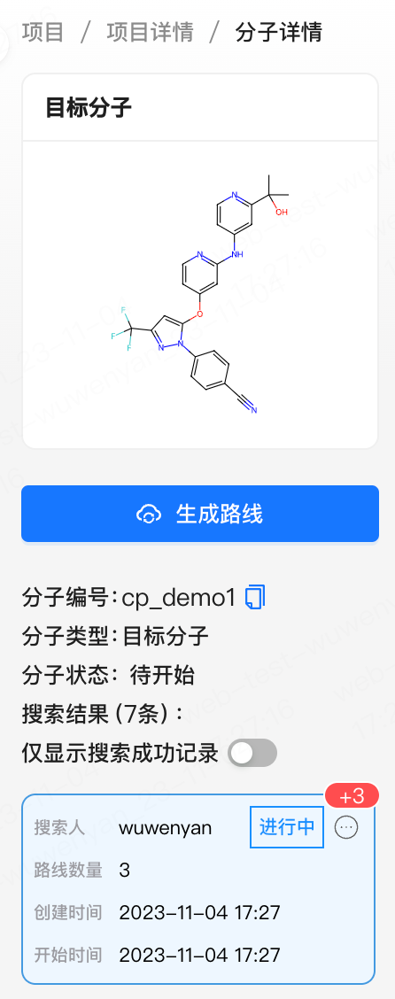

# 功能介绍

## 1、登录与布局
- 打开浏览器，输入事先提供的labwise系统网址，并输入事先提供的账号和密码，即可登录系统

- 左侧栏为一级导航栏，目前只开放了部分功能，包括“快速逆合成”、“项目”、“原料管理”，我们会在“项目栏”下进行添加项目、添加分子，搜索路线等一系列操作。也可以在“快速逆合成”栏目下直接输入我们要搜的分子并发起搜索
- 右侧为主界面

- 点击折叠按钮可以收起

## 2、项目
项目是任务的基本单元，由您创建的项目中的信息只能被您和您的协作者查看、管理。非项目成员无法看到项目中包括分子结构、路线在内的任何信息。通过创建一个项目，您可以在项目中邀请协作者，并且在项目中创建分子、进行逆合成、对路线进行管理。

### 2.1 创建一个项目
- 点击下图所示的新建项目按钮

- 点击按钮后的弹出框如下图所示：上半部分是项目设置，是关于项目基本信息的设置，用户可按需输入相关信息下半部分是人员配置，系统默认将当前登录用户设置为项目经理
  - 点击添加人员，输入其他账号，则可以将其他账号用户添加进本项目
  - 试用版系统我们只提供项目经理，项目成员两个角色，正式系统可以根据不同企业的组织关系定制角色及其权限
  - 项目经理可以在这个项目里新增、删除、修改成员，项目成员无人员配置相关权限

### 2.2 对已创建项目的编辑
- 对于已经建立的项目，点击项目记录右边操作列的设置，可更新项目交期，重新配置项目成员

- 点击下图中的添加人员邀请新的成员

- 项目经理点击这个编辑按钮可以对已加入项目的成员进行权限的编辑，或者点击“删除”将该成员移出项目

### 2.3 项目列表的排序和筛选
- 在项目列表中，我们可以通过点击每个项目属性旁的上下三角按钮，对当前属性按照升序和降序排列

- 项目列表上方是筛选栏，点击展开，可以按照各个字段进行筛选，点击“重置”按钮对筛选项进行重置，点击“查询”按钮确认筛选过滤条件并进行查询

### 2.4 取消项目
1. 点击下图中项目的状态栏可以将项目的状态改为已取消，输入取消的原因并且点击确认

2. 取消的项目默认不显示在列表中，勾选筛选器中的“已取消”状态，并且点击“查询”，可以看到以前取消的项目

## 3、添加分子与发起逆合成任务
### 3.1 添加分子
- 点击项目记录右边操作列的“查看”按钮，进入项目详情

- 点击右上方的“添加分子”按钮

- 可以为分子设定一个项目内的代号，此代号在项目内允许重复，选择分子优先级和负责人。在下方画板处，可以绘制分子结构式，常用reaxys的用户应该非常熟悉绘制分子结构式，此处不赘述
  

  - 📢：删除画板上的分子时，请选中该结构，再点击橡皮擦按钮

    
  
- 也可以点击左上角的文件夹按钮，选择第一个选项paste from clipboard，将分子的smiles贴进来，点击add to canvas，同样在画板上转化为了结构式
  - 📢：点击add to canvas后，要在画板上再点击一下，结构式才能被添加到画板上

- 也可以点击“选择文件”，上传一张分子结构式的图片

再点击“转结构”，等待几秒，即可看到转化出来的结构式，检查是否提取正确

- 点击右上角的提交按钮，该分子已经添加到本项目中

### 3.2  分子的排序和筛选
- 在分子这一栏下，会以分子卡片的形式展示，分子卡片右上角按钮可以放大分子，也可复制分子smiles
- 分子卡片上方是筛选栏，可以对分子进行筛选和排序，分子默认按最后修改时间倒序排序，也可以按名字升序或降序排序

### 3.3 取消分子
- 如果分子添加有误，可以在分子卡片的分子状态处将分子的状态改为“已取消”，并重新添加其他分子

### 3.4 发起逆合成搜索
- 点击分子卡片，进入分子详情。
- 点击生成路线，在弹窗中按需填写搜索要求，点击确定，即可发起逆合成任务

- 用户可以选择搜索模式，有3种模式可供选择：
  - 快捷模式可以在较短时间内出路线，平均2-3min左右
  - 精细模式会搜索出更多样的路线，但是搜索时间会较长，平均在10min-15min
  - 为我推荐模式是算法根据分子结构式预测分子的合成难度，智能推荐出一组搜索参数

三种搜索模式下的参数解释：
业务参数解释：
  - 最长链长度：控制AI生成路线的最长链长度小于这个值
  - 原料最大成本（元/g）：选择低于该值的原料进行路线设计，当算法给出的路线中存在较贵的物料时，可以调低这个参数重新搜索
  - 原料库：算法将使用在这个范围内的原料库，默认全选在原料管理模块下维护的多个原料库，用户可自行调整
  - 增加原料：将此化合物加入本次搜索的原料库。支持添加多个原料。我们的物料库可能不完全包含所有能被购买到的物料，可以通过添加物料扩大本次搜索的物料库，
  - 忽略原料（遇到继续展开）：将此化合物排除在原料库外，搜索到这些分子的时候，继续拓展。支持忽略多个原料。

高级设置中的搜索参数解释：
  - 单步反应的置信度阈值：置信度是算法对于反应可行性的判断，算法将过滤低于这个置信度阈值的反应，一般不用调整
  - 搜索宽度的窗口大小：算法相关的参数，一般不用修改，搜不出来路线时可适当放大
  - 逆向裁枝周期：算法相关参数，一般不用调整
  - 逆向分子生成选择窗口：算法相关参数，一般不用调整，搜不出来路线时可适当放大
  - 生成分子的最大长度：算法相关参数，一般不用调整，搜索特别复杂的分子时可适当放大
  - 是否路线聚类：算法依据路线相似度模型，在相似路线中取一条返回
  - 是否反应聚类：反应机理类似的反应，选其中一个返回，避免生成非常相似的路线

### 3.4 逆合成搜索任务查看
- 发起逆合成任务后，可以看到多了一个搜索卡片 ，显示“进行中”；
- 如果同时发起了多个分子的逆合成任务，前方有多个搜索任务在排队，会显示“排队中”；
- 如果跑模型的机器休眠，则首次唤起机器的任务需要多一段资源启动时间，此时状态会显示“准备资源”

- 搜索中的任务，如果算法搜到了新的路线，在卡片上有红色数字提示，用户可点击卡片即查看最新返回的路线

  
- 当一个搜索任务已经发起，您可以去编辑其他的分子，或者查看已经搜索出的路线了。在这个过程中您可以在左下角的任务栏中看到所有属于您的搜索记录，任务编号是项目编号和分子名称的组合，上面可以查看前方还有多少个任务在排队。
[图片]

- 搜索完成后的逆合成任务会有弹窗提醒。也可以在任务栏处快速查看已完成的逆合成任务。 点击查看按钮，则可看到返回的多条路线。搜索过程中，可以点击“取消”取消搜索，此时不会返回任何路线
  - 在搜索记录卡片上，会显示本次搜索最终返回的路线数量，鼠标悬浮到右边图标，可以点击查看本次搜索的参数和搜索日志
[图片]

[图片]
[图片]

- 无搜索结果的搜索记录卡片默认不展示，可以关闭此按钮，显示全部搜索记录
- 等到刚刚发起的逆合成任务完成后，我们可以重新点击生成路线，选择其他搜索模式，重新发起逆合成
### 3.5使用之前搜索过的参数重新搜索
- 点击此处的搜索参数进入搜索参数
[图片]
- 点击参数底部的“重新搜索”，修改后重新发起逆合成，这个过程中可以对参数进行调整
[图片]
[图片]
## 4、路线筛选与查看、反应查看
### 4.1 路线查看
- AI路线下是算法返回的路线最长链列表，左右滑动可以看到完整链路。每条最长链上，我们都用黄色边框标记了目标产物，蓝色边框标记了中间体，黑色虚框标记了关键起始物料，每个分子和反应我们都可以对其进行放大和smiles复制，以下是相关指标的解释：
  - 路线长度：同一条最长链下如果有多种支链方案，则表示路线总步数最短的支链方案的总步数
  - 最长链长度：若有支链方案，则在支链处取贡献原子最大的一条主链，该主链的总步数即为最长链长度
  - 支链情况：显示包含的路线是“无支链”，“有支链”或者“有多种支链”
  - 算法智能评分：算法对路线进行智能打分得出的结果，分数范围在0-100之间
  - 已知反应占比：路线中已在文献/专利中报道过的反应数量占路线总步数的比例
  
- 点击查看，可以查看路线详情
[图片]
- 如果有多个支链方案，则会提示用户该最长链有多种支链，可以切换查看多个支链方案
[图片]
### 4.2 路线收藏
您可以在浏览的过程中收藏比较好的路线，用于后续的比较/编辑
- 点击收藏，可以收藏路线，再次点击，可以取消收藏
[图片]
[图片]
- 打开筛选器，可以选择仅显示收藏路线，快速查看和比较几条收藏的路线
[图片]

### 4.3 路线评论
- 点击评论，可以对此条路线进行评论，本项目中的所有成员都可以查看评论和编辑评论，从而达到路线筛选时的交流目的
[图片]

- 进入路线详情，仍然可以对每个具体的支链方案进行评论
[图片]

### 4.4 路线排序、分组和筛选
您可以对返回的AI路线根据路线长度、最长链长度、算法智能评分、已知反应占比进行排序筛选，尽快找到满意路线
- 所有AI返回的路线，默认展示AI推荐的前20条，此20条是按关键起始物料一致的分为一组，呈现时把同组的进行打散，并按算法智能评分降序排序
- 切换右上角的“所有路线”，出现筛选按钮
[图片]
- 可以对所有路线进行其他的筛选操作，如可以按照其他指标对路线进行排序，分组，可以过滤出评分大于60分的路线，或路线长度小于6步的路线，或仅展示收藏的路线
[图片]

- 路线分组方式
  - 关键起始物料一致：将关键起始物料一致的作为一组
  - 算法聚类：根据算法计算的路线相似度，将路线相似度高的聚成一类
  - 不分组
- 分组后会在路线上显示组号，点击组号，可以把该分组下的所有其他路线筛选出来
[图片]
- 点击×号，恢复原状
[图片]

### 4.5 反应检索
- 点击每一步反应，右侧弹窗展示推荐反应和反应库，推荐反应可以看到这步反应其他的物料，如果这个反应已存在，则会标记出是“报道反应”，下方反应库则是我们从海量的文献和专利中抽取出来的与推荐反应相同或最相似的反应，用户可以查看具体的反应式和Procedure
[图片]
- 若有多个推荐反应，点击某个推荐反应的卡片，则可以对下面的反应库按照该推荐反应做一个过滤，再次点击卡片，取消选中
[图片]
### 4.6 物料价格信息检索
- 点击推荐反应处的查看物料
[图片]
- 可以查看到每个物质的CAS号，系统中存在的原料库的原料来源，并提供克价的对比，各家供应商提供的规格范围，点击供应商名称，即可跳转到相应的供应商购买页面。
  - 注意，当前系统里的原料数据并不是相应供应商网站上的实时数据，版本下标注的日期为展示的价格数据的抓取日期
[图片]
### 4.7 反应评论
- 对于推荐反应，我们同样可以进行评论，评论方式与路线一致
[图片]

### 4.8 路线导出
- 点击路线详情右上方的导出按钮，即可下载后缀为.cdxml的文件
[图片]

##5、路线编辑
- 在路线查看页面，点击右上角的编辑，则进入路线的编辑模式
### 5.1 添加中间体/原料
- 我们可以在路线上添加中间体，添加原料。点击每一步反应的加号，可以选择添加中间体，则是插入一步。也可以选择添加原料，则为这步反应多加了一个反应物
[图片]
### 5.2 删除中间体
- 也可以删除中间体，点击删除按钮，注意，如果是删除中间体，则会把后续的合成路径全部删除
[图片]

- 另外，我们还能点击撤回按钮撤销刚刚的编辑操作，放大缩小按钮对页面进行放大缩小
[图片]
### 5.3 以某个分子为目标分子重新逆合成
- 也可以以某个中间体或原料为目标分子重新逆合成，点击此按钮
[图片]
- 打开一个新页面，可以按逆合成流程重复一遍，相应的逆合成任务也会在左下角的任务栏中展示
[图片]
- 搜索过程中，原路线会变为只读状态
[图片]
- 搜索完成后，如果对此条路线比较满意，可以点击选中，用搜完的路线替换成原来的路线，如果不满意，则可以更改搜索参数重新搜索，或者回到原路线，取消该流程
[图片]
[图片]

### 5.4 保存路线
- 点击右上角的保存按钮，可以将该路线保存到我的路线，且状态为“编辑中”
[图片]
  
[图片]

### 5.5 确认路线
- 点击右上角的确认按钮，可以将该路线保存到我的路线，且状态为“已确认”
[图片]
[图片]

## 6、原料管理
- 左侧栏的一级菜单栏下的原料管理下有“原料库管理”，点击即可查看全部原料库
[图片]
- 点击分子式搜索，可以绘制分子结构式或输入smiles进行搜索，也可以直接在筛选栏里，输入CAS，中文名、英文名，进行原料搜索
[图片]
[图片]

- 可以切换到其他5种原料库
[图片]
- 点击某个具体原料右侧的来源列，可以直接跳转到购买链接
[图片]

[图片]

## 7、报价
## 7.1 报价入口
点击项目详情页右上角的报价
[图片]

进入报价列表，默认显示有确认路线的分子。若该项目下的分子都没有确认路线，则默认都不显示
[图片]

若该项目下的分子至少有一条确认路线，则显示该分子，点击下方的“添加报价”，即可添加报价
如何确认路线，请查看文档：产品功能介绍（图文版） 
[图片]
## 7.2 添加报价
点击添加报价，输入目标质量、纯度、FTE_rate（每日人力成本）、系数（物料的溢价系数），点击确定，即可进入报价详情页
- 如果有多条路线，则会同时报多条路线的价格
[图片]

### 7.3 报价详情
整个报价详情页分为6大部分，报价参数、已确认路线、报价summary、物料明细表、工时明细表、反应明细，下面将依次介绍。
#### 报价参数
  - 根据输入的质量、纯度，去推算每步需要的物料质量
  - FTE Unit/￥每天：每天的人工成本
  - 系数：物料的溢价系数，即，物料成本报价 =  计算好的成本 * 系数
[图片]
#### 存为草稿
  - 保存当前路线的报价单。若不保存，离开当前页面后，所有的改动都不会保存
#### 确认报价
  - 确认当前路线的报价单，已确认的报价单才支持下载
#### 已确认路线
  - 若该分子有多条确认路线，则可以切换上一条、下一条分别进行报价
  - 点击路线编号，可以查看完整路线

[图片]

#### 报价summary
[图片]
- 预计交付时间：根据每步工时加总得来
- 报价summary：所有成本项的加总
- 展示每条路线下的物料成本、工时成本
  - 物料成本根据每步的物料汇总而来
  - 工时成本根据每步的procedure推算而来
  - 若报价里还需要包含其他收费项，可以点击新增收费项，目前支持增加手性分离收费和其他试剂收费
[图片]

#### 物料明细表
每一步的物料成本都汇总在物料明细表内
- 需求质量列是根据需求的目标分子质量计算得出
- 成本列是根据需求质量，在供应商的原料数据中匹配到最合适的
- 报价列是成本列 * 系数计算得出
- 用户均可以更改
[图片]
- 点击编辑，可以编辑除结构式外的其他信息，也可以删除
[图片]
- 点击供应商，可以看到原料供应商的规格、纯度、价格等数据，数量标为1的地方，是系统默认选的规格，并以此计算成本。点击供应商的名字，可以直接打开该供应商的购买链接。
[图片]
若想更换为其他规格，可以点击右上角的编辑，在需要的规格行里编辑数量。
[图片]

#### 工时明细表
[图片]
- 点击编辑，可以更改每步的预计工时，这个值会影响分子交付时间，和人力成本

#### 反应明细
[图片]
- 点击“所需人天”右边的“编辑”，也可以更改该步反应的工时
- 点击每步反应下的物料，可以编辑，也可以删除物料
- 另外，点击“添加物料”，可以新增一个物料，但是需要用户手动输入当量、需要的质量、成本、报价等信息

### 7.4 报价列表
存为草稿和确认报价的报价单会在报价列表中显示
[图片]

已确认的报价，点进去可以重新编辑。点击编辑，重新回到编辑状态
[图片]

点击删除，可删除报价单
[图片]

### 7.5 其他质量报价
已确认的报价，可以基于此份报价，快速进行其他质量的报价
[图片]
点击“其他重量报价”，输入质量，点击确定，可以快速创建一份报价单。
[图片]

### 7.6 下载报价单
点击“下载报价单”，已确认的报价单都会被以word形式下载下来。格式方面，可以依据每家公司的要求做定制化处理。
[图片]

word版报价单格式如下：
[图片]
### 7.7 注意事项
- 创建报价单时，如果用户只确认了路线，没有确认每一步的反应，则系统默认选推荐分数最高的procedure去报价
- 用户最好提前确认好反应，及其收率。若未确认，且默认选择的procedure没有收率，系统默认按收率50%处理
- 有部分金属催化剂、配体，如Pd(dppf)Cl2, Pd2(dba)3，在结构式展示上不符合化学家预期，我们还在寻找优化的解决方案。用户在添加和查看时，可以通过CAS来识别

